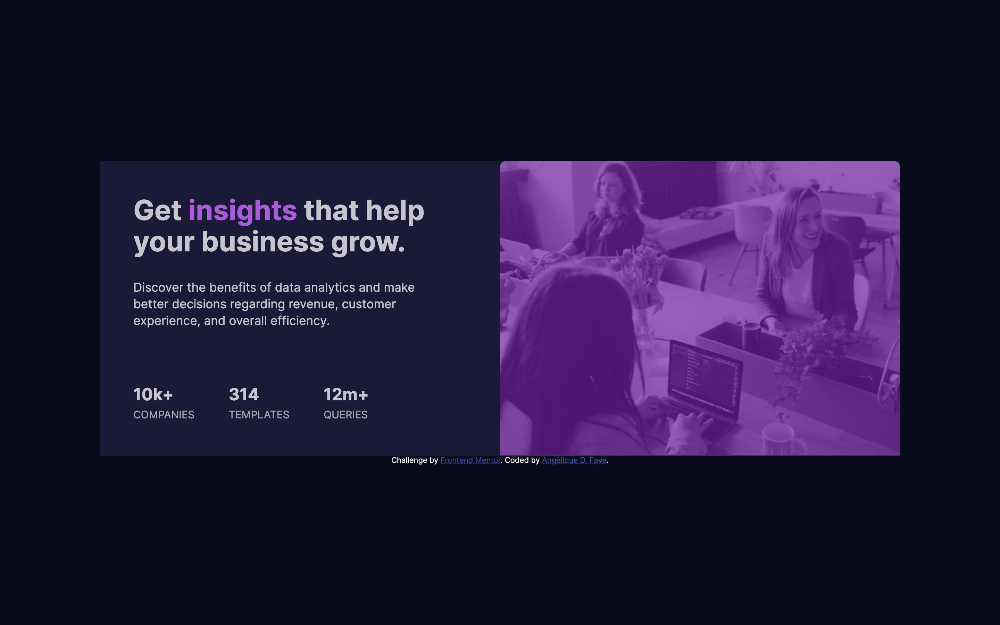

# Stats preview card component

## Overview

_Display the most important stats about your company to convince your visitors!_

 

## Links

<a href="https://github.com/AngeliqueDF/stats-preview-card-component">GitHub repo</a> • <a href="https://github.com/AngeliqueDF">Live demo </a>

 

## How to run the project

1. `git clone https://github.com/AngeliqueDF/stats-preview-card-component MY_FOLDER_NAME`
2. `cd MY_FOLDER_NAME`
3. `npm install`
4. `npm start`
5. visit `http://localhost:3000`

 

## Features

- Responsive.
- Accessible.
- Lightweight

## Technologies

- HTML
- CSS

 

## Description

A common component used to let visitors know what a company has to offer. Its main challenges were to ensure responsiveness and accessibility.

### How I built this project

1. Start by structuring the page with semantic and accessible HTML.

2. Check W3C compliance with the website or extension as I update the HTML structure.

 

## Author

- [@AngeliqueDF on GitHub.](https://github.com/AngeliqueDF)
- [Visit my website.](https://adf.dev)
- [View my Frontend Mentor profile.](https://www.frontendmentor.io/profile/AngeliqueDF)
